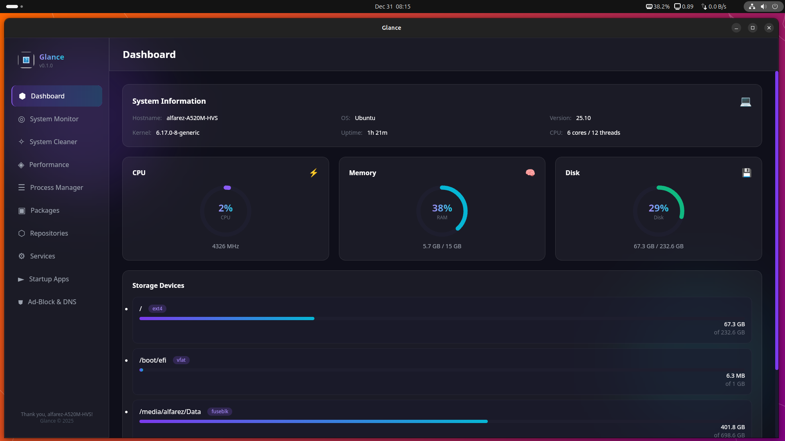
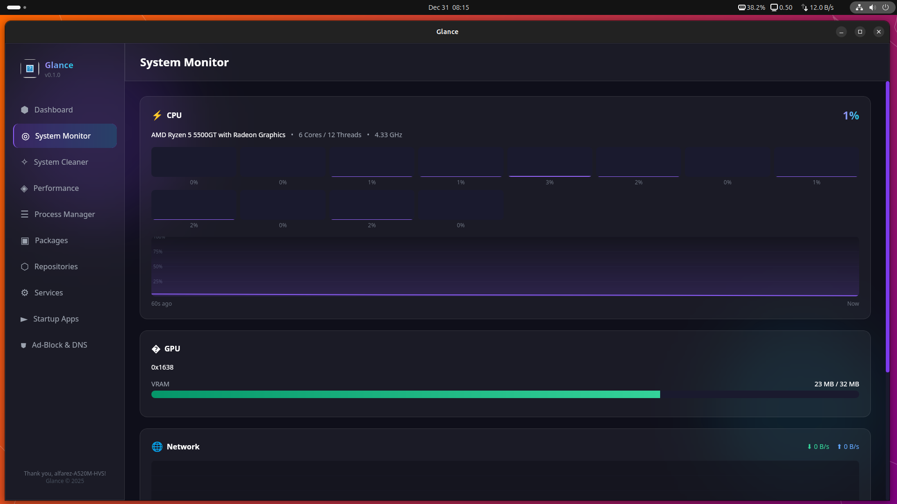
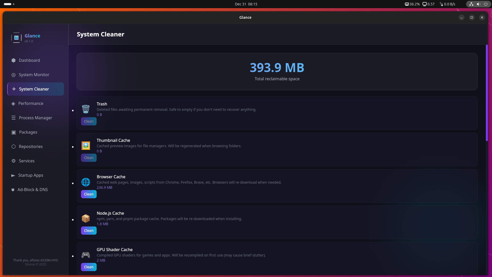
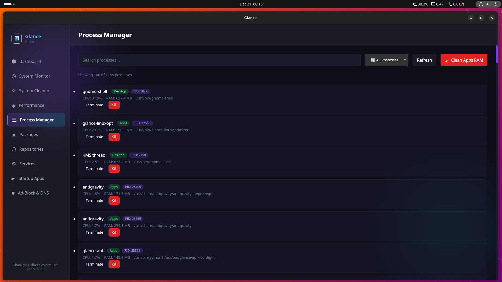
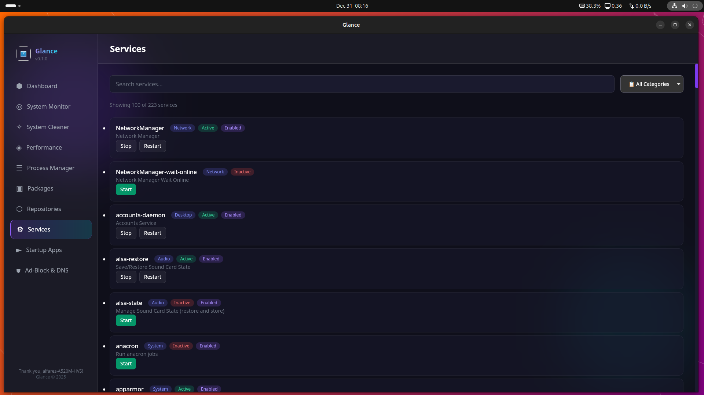
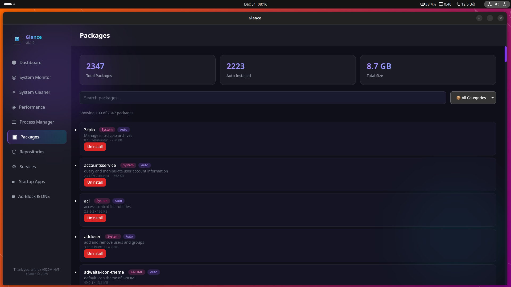

<p align="center">
  
</p>

<h1 align="center">Glance</h1>

<p align="center">
  <strong>🚀 The Modern Linux System Optimizer</strong>
</p>

<p align="center">
  <em>See Everything. Optimize Anything. Beautiful by Default.</em>
</p>

<p align="center">
  <a href="#features">Features</a> •
  <a href="#screenshots">Screenshots</a> •
  <a href="#installation">Installation</a> •
  <a href="#supported-distributions">Distros</a> •
  <a href="#development">Development</a>
</p>

<p align="center">
  
  
  
  
</p>

<p align="center">
  
  
  
  
</p>

<details>
<summary><strong>📊 View Language Breakdown</strong></summary>

<br>

```
Rust         ████████████████████████████████████▌        67.5%
Svelte       ████████████▊                                25.5%
TypeScript   ██▌                                           5.1%
CSS          ▋                                             1.3%
Other        ▎                                             0.6%
```

| Language | Percentage | Description |
|----------|------------|-------------|
| 🦀 **Rust** | 67.5% | Backend, system APIs, privilege handling |
| 🔥 **Svelte** | 25.5% | Frontend UI components |
| 📘 **TypeScript** | 5.1% | Type definitions, services |
| 🎨 **CSS** | 1.3% | Glassmorphism styling |
| 📦 **Other** | 0.6% | Config files, scripts |

</details>

---

## ✨ What is Glance?

**Glance** is a next-generation Linux system utility that combines **monitoring**, **cleaning**, and **optimization** into one stunning application. Built with Tauri v2 and Svelte 5, it delivers a native-like experience with a modern glassmorphism UI.

> 💡 *"Finally, a Linux optimizer that doesn't look like it's from 2005."*

---

## 🎯 Features

### 📊 System Dashboard
Real-time overview of your system health with beautiful stats cards.
- CPU usage, frequency, and per-core breakdown
- Memory usage with cached memory visibility
- Disk usage across all mounted partitions
- Network traffic monitoring
- System uptime and distro information

### 📈 Resource Monitor  
Live performance graphs with historical data.
- CPU usage history (60 data points)
- Memory usage trends
- Network RX/TX speeds
- Disk read/write speeds
- GPU monitoring (NVIDIA & AMD)

### 🧹 System Cleaner
Reclaim disk space safely and efficiently.
- 🗑️ **Trash** - Empty recycle bin
- 🖼️ **Thumbnails** - Clear cached thumbnails
- 🌐 **Browser Caches** - Chrome, Firefox, Chromium  
- 📦 **Package Cache** - APT/Pacman/DNF cache
- 📋 **Logs** - Old journal logs
- 🐍 **Python Cache** - `__pycache__` folders
- 📦 **Old Kernels** - Unused kernel packages
- 💥 **Crash Reports** - System crash dumps
- ⏰ **Auto-Clean** - Scheduled cleanup (daily/weekly/monthly)

### ⚡ Performance Tweaks
Optimize your system with one-click settings.

| Category | Tweaks |
|----------|--------|
| **Memory** | Swappiness, VFS Cache Pressure, Dirty Ratio, **ZRAM** |
| **Network** | TCP BBR, Fast Open, MTU Probing, Buffer Sizes |
| **CPU** | Governor (Performance/Balanced/Powersave) |
| **Disk** | I/O Scheduler (mq-deadline/bfq/kyber) |

### 📦 Package Manager
Manage installed packages with smart categorization.
- Search and filter packages
- View package size and description
- Uninstall or purge packages
- Auto-remove unused dependencies
- Category filters (GNOME, KDE, Development, etc.)

### 🔧 Services Manager
Control systemd services with ease.
- Start/Stop/Restart services
- Enable/Disable at boot
- Category-based filtering
- Memory usage per service

### 🚀 Startup Apps
Manage autostart applications.
- Toggle apps on/off
- View command and icon
- Cross-DE support (GNOME, KDE, XFCE, etc.)

### 🌐 Repository Manager
**Multi-distro** mirror management with speed testing.

| Distro | Mirrors | Fast Download |
|--------|---------|---------------|
| Ubuntu/Debian | 70+ | apt-fast |
| Arch Linux | 35+ | powerpill |
| Fedora/RHEL | 22+ | dnf (built-in) |
| openSUSE | 21+ | aria2 |

- Add/Remove PPAs (Debian/Ubuntu)
- Region-based filtering (50+ countries)
- Parallel speed testing
- One-click mirror switching

### � Hosts Editor
DNS-level ad blocking and custom hostnames.
- Import blocklists (StevenBlack, etc.)
- Add custom entries
- Toggle entries on/off
- Search and filter

### 🔒 DNS Manager
Configure system DNS settings.
- Popular presets (Cloudflare, Google, Quad9)
- Custom DNS configuration
- Clear DNS cache

### 🎮 Gaming Center
**One-Touch Linux Gaming Setup** - inspired by Nobara Project & AdelKS Linux Gaming Guide.

| Layer | What It Does |
|-------|--------------|
| **Layer 1** | Enable 32-bit (i386) + GPU Drivers (NVIDIA/AMD/Intel) |
| **Layer 2** | Vulkan loader + Wine + GameMode |
| **Layer 3** | Kernel Tweaks (vm.max_map_count, swappiness, ESYNC) |
| **Layer 4** | Steam + MangoHud + ProtonUp-Qt + Heroic |

#### ⚡ One-Touch Setup
Click one button to install everything needed for gaming on Linux:
- **System Profile Detection** - Auto-detects tier (Low/Medium/High) based on RAM, CPU, GPU
- **Gaming Checklist** - 6-point readiness check (32-bit, Vulkan, Drivers, Tweaks, Limits, GameMode)
- **One-Click Install** - Installs all 4 layers automatically

#### 📦 Essentials & Launchers
| App | Description |
|-----|-------------|
| 🎮 Steam | Valve's gaming platform |
| ⚔️ Heroic | Epic Games & GOG launcher |
| 🍷 Lutris | Run Windows games easily |
| 🔧 ProtonUp-Qt | Download GE-Proton |
| 📊 MangoHud | FPS overlay |
| ⚡ GameMode | Auto CPU boost |

#### 🚀 Performance Tweaks
| Tweak | Recommended | Description |
|-------|-------------|-------------|
| vm.max_map_count | 2147483642 | Prevents crashes in heavy games |
| vm.swappiness | 10 | Keep games in RAM |
| ESYNC/FSYNC | 1048576 | High file descriptor limit |
| Mouse Acceleration | Disabled | 1:1 raw input for FPS games |


---

## 📸 Screenshots

<p align="center">
  
</p>
<p align="center"><em>System Dashboard - Real-time system monitoring</em></p>

<p align="center">
  
</p>
<p align="center"><em>System Monitor - Live resource graphs</em></p>

<p align="center">
  
</p>
<p align="center"><em>System Cleaner - Reclaim disk space</em></p>

<p align="center">
  
</p>
<p align="center"><em>Performance Tweaks - Optimize system settings</em></p>

<p align="center">
  
</p>
<p align="center"><em>Package Management - Manage installed packages</em></p>

<p align="center">
  
</p>
<p align="center"><em>Services Control - Manage systemd services</em></p>

<p align="center">
  
</p>
<p align="center"><em>Repository Manager - Manage mirrors and PPAs</em></p>

<p align="center">
  
</p>
<p align="center"><em>Ad-Block & DNS - DNS-level ad blocking</em></p>

---

## �️ Supported Distributions

| Family | Distributions |
|--------|---------------|
| **Debian** | Ubuntu 20.04+, Debian 11+, Linux Mint, Pop!_OS, Elementary |
| **Arch** | Arch Linux, Manjaro, EndeavourOS, Garuda, Artix |
| **Fedora** | Fedora 38+, RHEL 9+, CentOS Stream, Rocky, AlmaLinux |
| **SUSE** | openSUSE Tumbleweed, openSUSE Leap 15.5+, SLES |

> ⚠️ **Note**: Some features (like APT repositories) are only available on compatible distros. The app automatically adapts to your system.

---

## 📥 Installation

### Option 1: Download Release (Recommended)

Download the latest `.deb`, `.rpm`, or `.AppImage` from the [Releases](https://github.com/yourusername/glance/releases) page.

```bash
# Debian/Ubuntu
sudo dpkg -i glance_*.deb
sudo apt-get install -f  # Install dependencies

# Fedora/RHEL
sudo dnf install glance-*.rpm

# Arch (AUR coming soon)
# yay -S glance
```

### Option 2: Build from Source

#### Prerequisites

```bash
# Debian/Ubuntu
sudo apt install libwebkit2gtk-4.1-dev build-essential curl wget \
  libssl-dev libgtk-3-dev libayatana-appindicator3-dev librsvg2-dev \
  nodejs npm

# Fedora
sudo dnf install webkit2gtk4.1-devel openssl-devel curl wget \
  libappindicator-gtk3-devel librsvg2-devel nodejs npm

# Arch
sudo pacman -S webkit2gtk-4.1 base-devel curl wget openssl gtk3 \
  libappindicator-gtk3 librsvg nodejs npm
```

#### Install Rust

```bash
curl --proto '=https' --tlsv1.2 -sSf https://sh.rustup.rs | sh
source $HOME/.cargo/env
```

#### Clone & Build

```bash
git clone https://github.com/yourusername/glance.git
cd glance

# Install frontend dependencies
npm install

# Development mode
npm run tauri dev

# Production build
npm run tauri build
```

The packaged application will be in:
- **Debian**: `src-tauri/target/release/bundle/deb/`
- **RPM**: `src-tauri/target/release/bundle/rpm/`
- **AppImage**: `src-tauri/target/release/bundle/appimage/`

---

## 🛠️ Development

### Tech Stack

| Component | Technology |
|-----------|------------|
| Backend | **Rust** + Tauri 2.0 |
| Frontend | **Svelte 5** + TypeScript |
| Styling | Vanilla CSS (Glassmorphism) |
| Build | Vite |

### Project Structure

```
glance/
├── src/                    # Frontend (Svelte)
│   ├── App.svelte         # Main application
│   ├── lib/services/      # API layer
│   └── app.css            # Styles
├── src-tauri/             # Backend (Rust)
│   ├── src/
│   │   ├── modules/       # Feature modules
│   │   ├── adapters/      # Distro adapters
│   │   ├── utils/         # Helpers
│   │   └── lib.rs         # Entry point
│   └── Cargo.toml
└── package.json
```

### Running Tests

```bash
# Backend tests
cd src-tauri && cargo test

# Lint check
cargo clippy

# Format check
cargo fmt --check
```

### Multi-Distro Development

Use the `FORCE_DISTRO` environment variable to simulate different distributions:

```bash
FORCE_DISTRO=arch npm run tauri dev     # Arch Linux
FORCE_DISTRO=fedora npm run tauri dev   # Fedora
FORCE_DISTRO=suse npm run tauri dev     # openSUSE
npm run tauri dev                        # Native (auto-detect)
```

---

## 🔐 Security

- **Privilege Escalation**: Uses `pkexec` (PolicyKit) for root operations
- **Command Whitelist**: Only approved commands can be executed as root
- **Timeout Protection**: 30-second timeout on all privileged operations
- **Input Validation**: Package names and paths are sanitized

---

## 🤝 Contributing

Contributions are welcome! Please read our [Contributing Guide](CONTRIBUTING.md) before submitting PRs.

1. Fork the repository
2. Create your feature branch (`git checkout -b feature/amazing-feature`)
3. Commit your changes (`git commit -m 'Add amazing feature'`)
4. Push to the branch (`git push origin feature/amazing-feature`)
5. Open a Pull Request

---

## 📄 License

This project is licensed under the **GPL-3.0 License** - see the [LICENSE](LICENSE) file for details.

---

## 🙏 Acknowledgments

- **Tauri Team** - For the amazing Rust framework
- **Svelte Team** - For the reactive UI framework  
- **Stacer** - Inspiration for feature set
- All the mirror providers worldwide

---

<p align="center">
  Made with ❤️ for the Linux community
</p>

<p align="center">
  <sub>Built with Tauri + Svelte • Designed for Modern Linux</sub>
</p>
